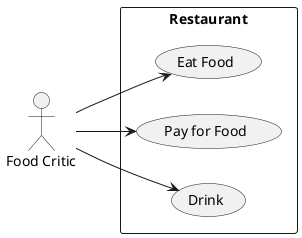

# Описание требований и архитектуры

## Введение
<!-- Общее краткое описание создаваемой системы -->
В рамках курса осуществляется проектирование решения на основе [постановки задачи от "заказчика"](../../task.md).

- [Описание требований и архитектуры](#описание-требований-и-архитектуры)
  - [Введение](#введение)
  - [Заинтересованные стороны](#заинтересованные-стороны)
  - [Бизнес-контекст (бизнес-требования)](#бизнес-контекст-бизнес-требования)
  - [Глоссарий](#глоссарий)
  - [Модель предметной области](#модель-предметной-области)
  - [Требования к системе](#требования-к-системе)
    - [Сценарии использования (Use case)](#сценарии-использования-use-case)
    - [Функциональные требования](#функциональные-требования)
    - [Ключевые бизнес-метрики](#ключевые-бизнес-метрики)
    - [Нефункциональные требования/Требования к атрибутам качества](#нефункциональные-требованиятребования-к-атрибутам-качества)
    - [Ограничения](#ограничения)
  - [Архитектура](#архитектура)
    - [Журнал архитектурных решений](#журнал-архитектурных-решений)
    - [Контекст решения](#контекст-решения)
    - [Компонентная архитектура](#компонентная-архитектура)
    - [Реализация сценариев использования](#реализация-сценариев-использования)
    - [Программные интерфейсы](#программные-интерфейсы)
    - [Схема развертывания](#схема-развертывания)
  
## Заинтересованные стороны
<!-- Перечень заинтересованных сторон и их интересов по отношению к создаваемой системе. 
Подробнее: https://confluence.mts.ru/pages/viewpage.action?pageId=399975538 
-->
| Заинтересованная сторона | Интересы           |
|:-------------------------|:-------------------|
| *Руководитель проекта*               | *Внедрение новой платформы для проведения конференций* |
| *Подрядчик*               | *Заработок* |
| *Проектная команды*               | *Автоматизация ручных поцессов* |
| *Руководитель отдела обучения*               | *Экономия на внешнем обучении* |
| *ВП*               | *Развитие внутренних продуктов* |

## Бизнес-контекст (бизнес-требования)
<!-- Общее описание бизнес-контекста создаваемой системы (автоматизируемой деятельности), список бизнес-целей заинтересованных сторон 
Подробнее: https://confluence.mts.ru/pages/viewpage.action?pageId=399973845
-->
Система должна выполнять:
- Экономия внешнего обучения, на которое постоянно стремятся сотрудники
- Взращивание компетенций собственных сотрудников
- Автоматизация регистарции докладчиков
- Автоматизация модерации обучающих материалов
- Автоматизация расписания конференций
- Проведение онлайн трансляций
- Для роста копметенций сотрудников компании. Необходимо иметь хранилище материалов, которое можно шарить сотрудникам
- Увеличение прибыли компании. Необходимо иметь возвожность получать доход от регистрации пользователей онлайн конференции как дополнительный канал прибыли

## Глоссарий
<!-- Содержит основные понятия и термины предметной области  
Подробнее: https://confluence.mts.ru/pages/viewpage.action?pageId=375782595
-->
| Понятие                        | Сокращение                         | Определение                       |
|:-------------------------------|:-----------------------------------|:----------------------------------|
| *Регистрация докладчика* | REGISTRATION | *Функционал работы системы, который позволяет пройти регистрацию на платформе, загрузить материалы, которые необходимо проверить* |
| *Модерация материалов* | MODERATION | *Функционал работы системы, который позволяет проверить материалы на плагиат, структуру, bad words* |
| *Формирование расписания* | SCHEDULE | *Функционал работы системы, который позволяет собрать промодерированные работы и организовать планируемое мероприятие* |
| *Трансляция* | CONFERENCE | *Функционал работы системы, который позволяет провести трансляцию конференции и собрать ОС* |

## [Модель предметной области](data/data.md)

## Требования к системе

### Сценарии использования (Use case)
<!-- Подробное описание сценариев использования системы с привязкой к ролям участников и задействованным бизнес-сущностям 
https://confluence.mts.ru/pages/viewpage.action?pageId=375782108 
https://confluence.mts.ru/pages/viewpage.action?pageId=375782119 
-->
#### Диаграмма сценариев использования (Use Case Diagram) <!-- omit in toc -->

#### Список сценариев использования <!-- omit in toc -->

| ID     | Описание                                          |
|--------|---------------------------------------------------|
| UC.001 | *[Название сценария использования](uc/uc.001.md)* |

### Функциональные требования
<!-- Описание требований к функциям, реализуемым системой. Требование может быть привязано к сценарию использования или быть общим 
Подробнее: https://confluence.mts.ru/pages/viewpage.action?pageId=375782501 
-->
| ID     | Функциональное требование             |
|--------|---------------------------------------|
| FR.001 | *Система должна из пользовательского интерфейса создавать аккаунт докладчика и сохранять его данные* |
| FR.002 | *Система должна из пользовательского интерфейса давать возможность докладчику загружать материалы в свой профиль и сохранять их* |
| FR.003 | *Система должна из пользовательского интерфейса создавать аккаунт модератора и сохранять его данные* |
| FR.004 | *Система должна предоставить модератору список всех докладчиков с их материалами, доступными к првоерке. Результатом выполнения этой функциональности должен быть подтвержденный/отклоненный материал* |
| FR.005 | *Система должна из пользовательского интерфейса создавать аккаунт организатора и сохранять его данные* |
| FR.006 | *Система должна из пользовательского интерфейса давать возможность организатору составлять мероприятия, добавляя докладчиков* |
| FR.007 | *Система должна иметь возможность проводить онлайн трансляции докладчику, а также подключаться в браузере всем желающим* |
| FR.008 | *Система должна иметь возможность собрать ОС во время/после конференции* |

### Ключевые бизнес-метрики
- Количество слушателей на конференции 10к
- Вовлеченность аудитории (количество активных слушателей) не менее 20% от общего числа
- CSI - удовлетворенность сервисом со значением не ниже 4.5 из 5
- Повторное посещение конференции пользователеми не менее 5%

### Нефункциональные требования/Требования к атрибутам качества
<!-- Требования к основным архитектурным характеристикам (атрибутам качества) системы - надежность, масштабируемость, ИБ, и др.
Подробнее: https://confluence.mts.ru/pages/viewpage.action?pageId=375782530
-->
| ID     | Атрибут качества             | Описание требования                       |
|--------|------------------------------|-------------------------------------------|
| QR.001 | *Удобство использования* | *На основании метрики CSI* |
| QR.002 | *Доступность* | *Возможное кол-во слушателей на конференции*. Необходимо обеспечить скорость отклика системы не менее 1с с момета запроса |
| QR.003 | *Производительность* | *Возможное кол-во активных слушателей. Обеспечить одновременное кол-во запросов не менее 5 в секунду* |
| QR.004 | *Надежность* | *На основании стабильной работы системы. Класс критичности минимум BS* |
| QR.005 | *Масштабируемость* | *На основании новых зарегистрированных слушателей* |

### Ограничения
<!-- Описываются ограничения, оказывающие влияние на архитектуру системы - временные, финансовые, технологические
Подробнее: https://confluence.mts.ru/pages/viewpage.action?pageId=375782592
-->
| ID     | Ограничение            |
|--------|------------------------|
| AC.001 | *Описание ограничения* |

## Архитектура

### Журнал архитектурных решений
<!-- Записи о ключевых принятых архитектурных решениях (ADR) для реализации архитектурно-значимых требований.
Подробнее: https://confluence.mts.ru/pages/viewpage.action?pageId=421162308
-->
- [ADR.001 Решение по выбору категории системы](adr/adr-template.md)
- [ADR.002 Решение по выбору шаблона интеграции](adr/adr-template2.md)

### [Контекст решения](context/context.md)

### [Компонентная архитектура](components/components.md)

### Реализация сценариев использования
<!-- Реализация сценариев использования на основе взаимодействия компонентов системы и внешних систем/участников.
Диаграммы последовательности (UML Sequence diagram) и текстовое описание.

Подробнее: 
https://confluence.mts.ru/pages/viewpage.action?pageId=399442132
https://confluence.mts.ru/pages/viewpage.action?pageId=399442170
-->
| ID     | Описание                          | Реализация                                    |
|--------|-----------------------------------|-----------------------------------------------|
| UC.001 | *Название сценария использования* | [Реализация сценария](uc-impl/uc.001-impl.md) |

### Программные интерфейсы
<!-- Спецификации публичных API системы и ее компонентов (синхронных, событийных). Создается на основе модели предметной области для реализации сценариев использования. 
  Форматы: OAS/Swagger, GraphQL, AsyncAPI/CloudEvents
-->
| Компонент             | Интерфейс                                      |
|:----------------------|:-----------------------------------------------|
| *Название компонента* | *[Название интерфейса](api/service-name.yaml)* |

### [Схема развертывания](deployment/deployment.md)
